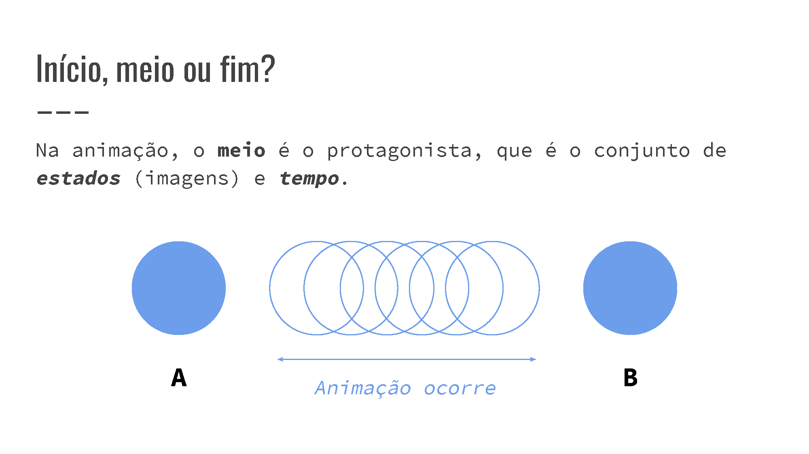
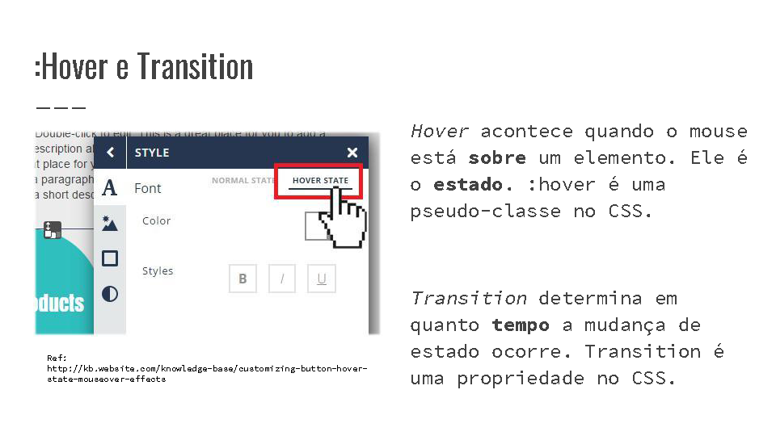
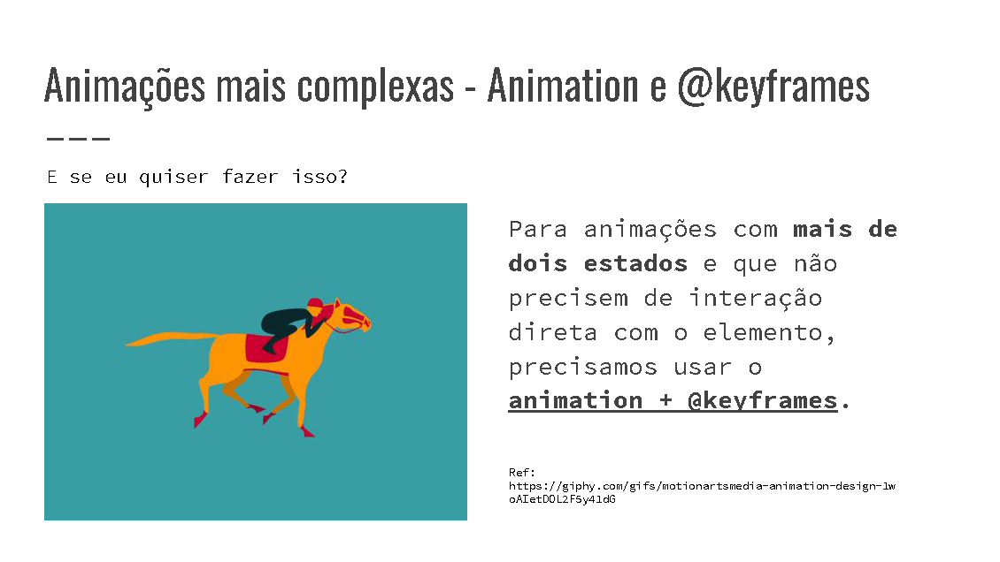

# Workshop Animações em CSS

Repositório referente ao Workshop de Animações em CSS, ministrado no dia 15/02/2019 na bancada da Codamos, durante a Campus Party 2019, em São Paulo.

Os slides estão disponíveis neste [link](https://speakerdeck.com/yogmel/animacoes-em-css-codamos-cpbr-2019).

### Alguns slides

## Pré-requisitos para navegação
Para entender esses documentos, é necessário ter uma noção básica de HTML e CSS. Para isso, sugiro ler algumas seções desse [repositório](https://github.com/reprograma/html-css-basico#html).

Também é necessário ter um **IDE ou editor de texto**, como Visual Studio Code, Sublime Text, Atom etc.

## Como usar esse repositório
1. Clone ou baixe o repositório para ter acesso a todos os arquivos.
2. Existem duas pastas:
    1. _public-alunos_: arquivos com toda estrutura HTML e com comentários em CSS, sem propriedades de animação. Bom pra quem quer praticar.
    2. _public-resolvido_: arquivos com estrutura completa de HTML e CSS, com animações prontas. Bom pra consulta ou estudo.

-------------

### Dúvidas?
Clique em _Issues_ e em _New issue_ e envie sua dúvida. Fico à disposição nas redes sociais e no email.
